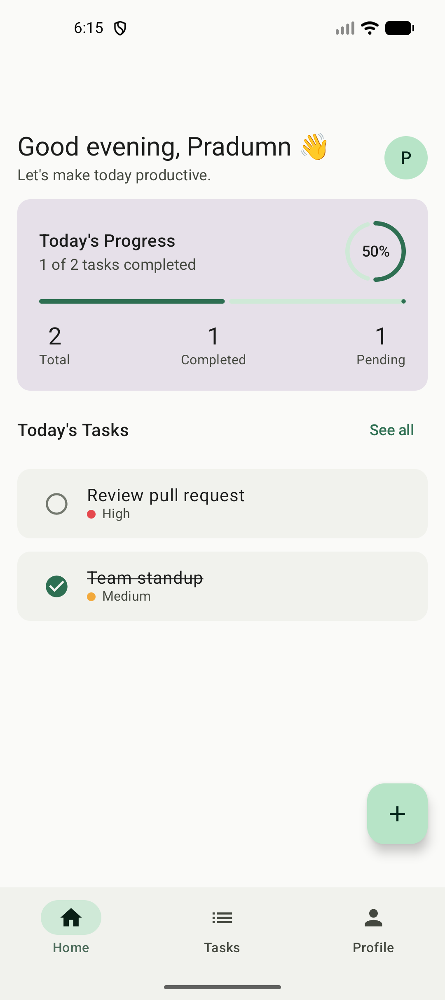
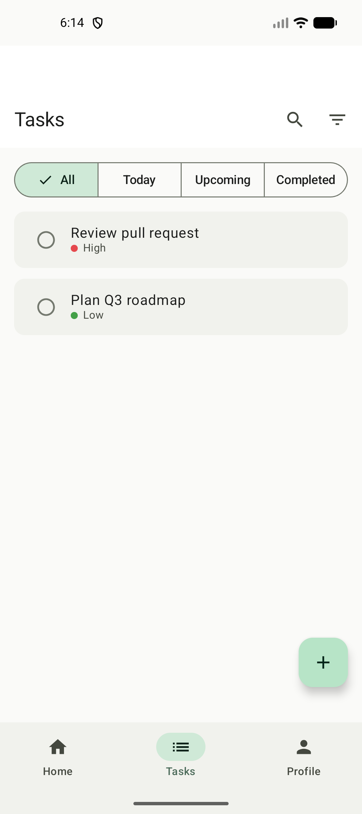
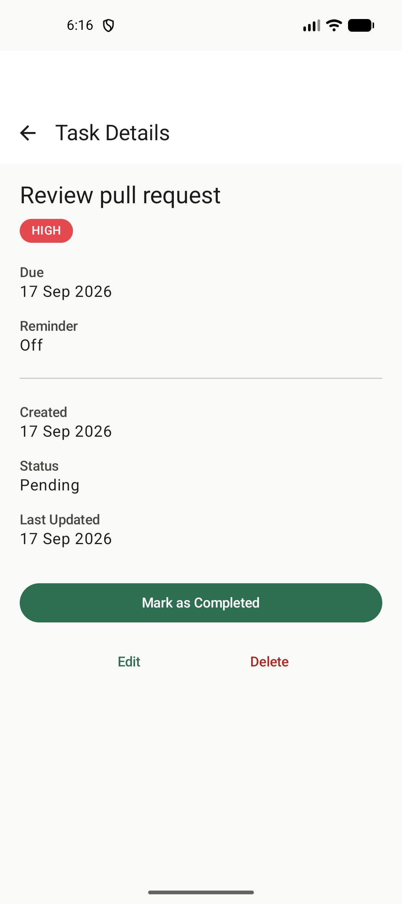
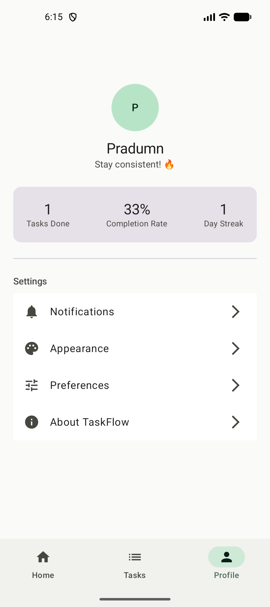

# TaskFlow

**Smart, offline-first task management for Android.**
Simple tasks. Big progress. Organize today. Build a better tomorrow.

TaskFlow is a small, production-shaped Android app built to demonstrate real Android
engineering — not just a Compose UI demo. Every task you create is written to a local
Room database first and is immediately usable offline; a WorkManager job syncs pending
changes to a remote backend in the background, with retry-with-backoff on failure.

<p align="center">
  
  
  
  
</p>

## Features

- **Home** — greeting, today's progress card (completion %, totals), today's tasks
- **Tasks** — segmented All/Today/Upcoming/Completed filters, search, priority filter,
  sort (due date / priority), swipe-to-complete, "Clear completed" with confirmation
- **Create / Edit Task** — title, description, priority, due date & time, reminder toggle,
  shared editor component for both flows
- **Task Details** — status transitions, edit, delete (with confirmation)
- **Notifications** — real notification channel, runtime permission handling (Android 13+),
  `AlarmManager`-scheduled reminders that survive reboot, tapping a reminder deep-links
  straight into that task's details screen
- **Offline-first sync** — every write lands in Room immediately; a `WorkManager`
  `SyncWorker` pushes pending changes to the remote backend when connectivity allows,
  with exponential backoff on failure; deletes are soft-deleted (tombstoned) so they can
  still be synced before being purged
- **Background cleanup** — a periodic `WorkManager` job archives completed tasks older
  than 30 days
- **Offline banner** — a live `ConnectivityManager`-backed banner tells you when you're
  offline and that changes will sync later
- **Profile** — productivity stats (tasks done, completion rate, current streak) and
  settings (notifications, appearance, preferences, about)

## Tech stack

| Layer | Choice |
|---|---|
| UI | Kotlin, Jetpack Compose, Material 3, Navigation Compose |
| Architecture | MVVM, Repository pattern, Use Cases |
| Async | Coroutines, Flow, StateFlow |
| Local persistence | Room (with a real schema migration, not destructive fallback) |
| Background work | WorkManager (`SyncWorker`, `CleanupWorker`), AlarmManager (reminders) |
| DI | Hilt (including Hilt + WorkManager `HiltWorkerFactory` wiring) |
| Networking | Retrofit, OkHttp, kotlinx.serialization (behind a swappable interface — see below) |
| Preferences | Jetpack DataStore |
| Testing | JUnit, MockK, kotlinx-coroutines-test, Compose UI testing |

## Architecture

```
Compose UI → ViewModel → Repository → Room (source of truth) ⇄ SyncWorker ⇄ Remote API
                                                                       ↑
                                                                 WorkManager
```

Every mutation goes through `TaskRepository`, which writes to Room first (so the UI updates
immediately, online or not) and then schedules a background sync — no call site has to
remember to trigger it. Reminders and sync work the same way: a single scheduler
(`ReminderScheduler`, `SyncScheduler`) is called from every mutation path, not duplicated
per screen.

```
app/src/main/java/com/taskflow/
├── core/
│   ├── common/          shared utilities, connectivity monitor
│   ├── data/            TaskRepository (single source of truth over Room)
│   ├── database/        Room entities, DAO, migrations
│   ├── datastore/       user preferences (DataStore)
│   ├── designsystem/    shared Compose components + theme
│   ├── domain/          use cases (productivity stats, today's summary)
│   ├── model/            domain models (Task, Priority, TaskStatus, ...)
│   ├── navigation/       nav graph, routes, deep links
│   ├── network/          TaskRemoteDataSource (fake now, real backend later)
│   └── notification/     reminder scheduling, channel, broadcast receivers
├── feature/
│   ├── home/ tasks/ taskeditor/ taskdetails/ profile/ settings/
└── worker/               SyncWorker, CleanupWorker, SyncScheduler
```

Each `feature` package follows the same shape: a `*Route` composable that wires up
`hiltViewModel()`, and a stateless `*Screen` composable that takes `UiState` + callbacks
directly — the latter is what the Compose UI tests exercise, with no Hilt or Activity
involved.

## Getting started

1. Clone the repo and open it in Android Studio (a recent stable release; this project
   targets `compileSdk 36` / AGP 8.13.2).
2. The app builds and runs immediately — no external service is required. `SyncWorker`
   currently talks to an in-process fake remote data source (`FakeTaskRemoteDataSource`),
   so you get real WorkManager scheduling/retry behavior without needing to provision
   anything.
3. (Optional, future) `local.properties` has two blank keys reserved for wiring up a real
   Supabase backend later — `SUPABASE_URL` and `SUPABASE_PUBLISHABLE_KEY`. Leave them blank
   for now; see `docs/DECISIONS.md` for the plan.
4. Run the app on an emulator or device (`minSdk 24`).

## Testing

```bash
./gradlew testDebugUnitTest          # unit tests: use cases, view models
./gradlew connectedDebugAndroidTest  # Compose UI tests (needs a running device/emulator)
```

## Project docs

This repo documents its own design process:

- [`docs/PRODUCT_SPEC.md`](docs/PRODUCT_SPEC.md) — the full product spec agreed before any
  code was written: screens, navigation, data model, architecture, tech stack, and what's
  explicitly out of scope for v1.
- [`docs/DECISIONS.md`](docs/DECISIONS.md) — the engineering decision log: what was built,
  in what order, and why, including the build-phase-by-phase history and the reasoning
  behind choices like AlarmManager-vs-WorkManager for reminders, the soft-delete sync
  model, and deferring the real backend swap-in.

## Status

All 11 planned build phases are complete: foundation, data layer, Home, Tasks,
Create/Edit Task, Task Details, Completed Tasks, Profile/Settings, Notifications,
WorkManager sync, and polish (offline banner, loading/error states, tests). The one
deliberately deferred piece is swapping the fake remote data source for a real Supabase
backend — the app is already built against a stable interface (`TaskRemoteDataSource`)
so that's a one-class change, not a redesign, whenever it's needed.

---

TaskFlow is the first in a small portfolio series of Android apps, each built to
showcase a different set of skills (this one: Android fundamentals, Room, WorkManager).
